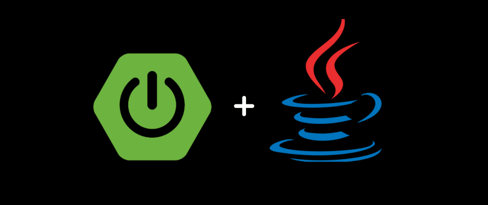
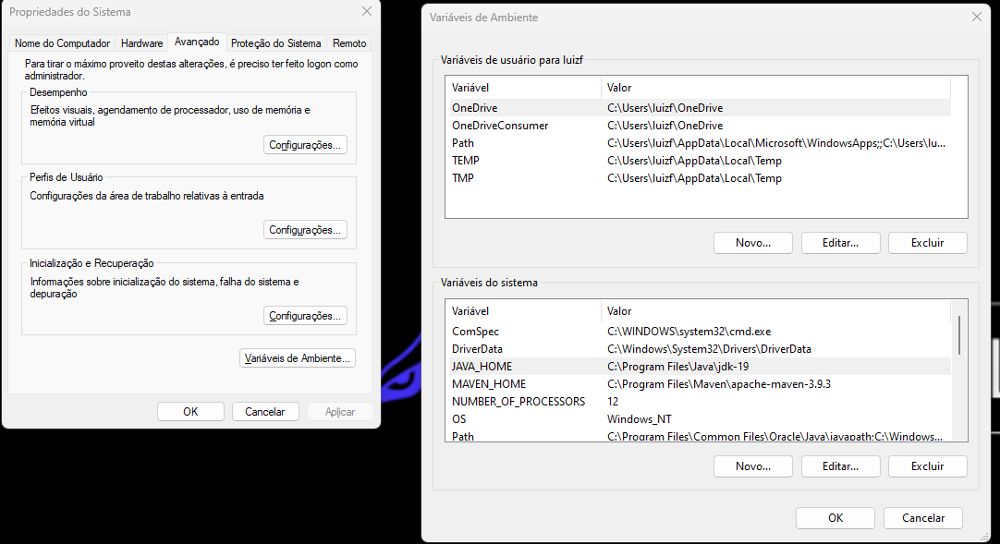
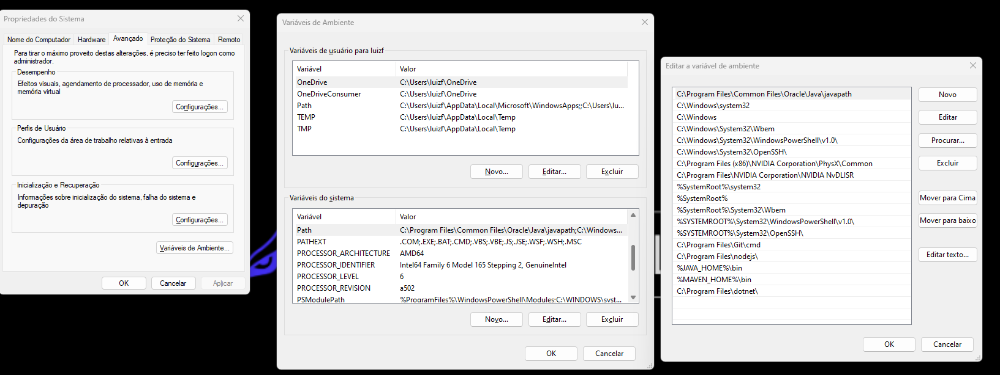

#  API RESTful - Spring Boot 🏹🟩



## 📗 Sobre

#### Livraria_api é uma API RESTful completa com Spring Boot, Spring MVC, Spring JPA e documentação para CRUD de duas classes associadas. A API permite realizar operações CRUD (Create, Read, Update, Delete) em duas classes associadas, utilizando os frameworks Spring Boot e Spring MVC para desenvolvimento e mapeamento objeto-relacional com Spring JPA.


## 🔨 Ferramentas

- [SPRING MVC](https://spring.io/guides/gs/serving-web-content)
- [SPRING JPA](https://spring.io/projects/spring-data-jpa)
- [SPRING BOOT](https://spring.io/projects/spring-boot)

## 🔦  Funcionalidades


- **Criação de API RESTful:**
  - Endpoints para realizar operações CRUD em duas classes associadas.
  - Suporte aos métodos HTTP padrão (GET, POST, PUT, DELETE).
  - Validação de entrada de dados.
  - Tratamento de erros.

- **Documentação automática:**
  - Geração de documentação completa da API em formato HTML ou JSON.
  - Descrição dos endpoints, parâmetros e respostas.
  - Exemplos de uso da API.

- **Gerenciamento de banco de dados:**
  - Conexão com banco de dados relacional (MySQL, PostgreSQL, etc.).
  - Persistência de dados usando JPA e Hibernate.
  - Transações para garantir a integridade dos dados.
<br>

## ♻️ Como contribuir para este projeto

```bash
# Clone o projeto
$ git clone https://github.com/rafaelbcabral/livraria-api.git
````
<br>

````bash
# Entrar no diretório
$ cd livraria-api
````
<br>

````bash
# Instalar as dependencias, caso use npm
$ npm install
````

<p style="text-align: center; font-size: 15px; "><b>OR</b></p>

````bash
# Caso use Yarn
$ yarn
````

## 🟢🟢 Instalação Spring boot 


## 🟠🔵 Como instalar o JAVA:

- <a href="https://www.java.com/pt-BR/download/" style="font-size: 20px">Download JAVA</a>

### ⚙️ Como configurar variáveis de ambiente do sistema:

  <p  style="font-size: 16px"> ➡️ Painel de Controle ➡️ Variáveis de Ambiente </p>

  - <b>JAVA_HOME:

    - C:\Program Files\Java\jdk-19
    
      


  - PATH:
    - %JAVA_HOME%\bin </b>
      


## 🟠🪶Como instalar Instalar o MAVEN:

- Maven é uma ferramenta de automação de construção (build) amplamente utilizada no universo Java e em projetos Spring Boot. Ela é projetada para simplificar o processo de gerenciamento de dependências, compilação, empacotamento e distribuição de projetos Java. Aqui estão os principais aspectos do Maven:

- Gerenciamento de Dependências: Uma das características mais poderosas do Maven é o seu sistema de gerenciamento de dependências. Com o Maven, você pode definir as bibliotecas e dependências que o seu projeto Java precisa e o Maven automaticamente cuidará de baixar essas dependências, bem como suas dependências transitivas (ou seja, dependências das dependências).

- Estrutura de Diretórios Padrão: O Maven define uma estrutura de diretórios padrão para projetos Java, o que facilita a organização do código-fonte, dos recursos e dos artefatos gerados. Isso ajuda a manter a consistência em diferentes projetos.

- Ciclo de Vida de Build: O Maven define um ciclo de vida de build comum que consiste em fases como compilação, teste, empacotamento (geração de JAR, WAR, etc.) e distribuição. Você pode executar essas fases individualmente ou em sequência, simplificando o processo de construção de um projeto.

- Plugins: O Maven é altamente extensível por meio de plugins. Existem plugins Maven para uma ampla variedade de tarefas, desde a integração com ferramentas de teste até a implantação em servidores de aplicação. Os desenvolvedores podem configurar esses plugins no arquivo de configuração pom.xml (Project Object Model).

- Repositórios: O Maven usa repositórios remotos e locais para armazenar e recuperar bibliotecas e dependências. Existem repositórios públicos amplamente utilizados, como o Maven Central, onde você pode encontrar uma grande variedade de bibliotecas Java.

- No contexto do Spring Boot, o Maven é frequentemente usado como a ferramenta de construção padrão para gerenciar as dependências e compilar aplicativos Spring Boot. O Spring Boot fornece modelos de projeto Maven prontos para uso que simplificam a configuração inicial de um projeto Spring Boot.

- Em resumo, o Maven é uma ferramenta essencial no ecossistema Java e Spring Boot que ajuda os desenvolvedores a automatizar tarefas de construção, gerenciamento de dependências e distribuição de projetos, facilitando o desenvolvimento de aplicativos Java e Spring Boot de forma eficiente e consistente.


<a href="https://maven.apache.org/download.cgi" style="font-size: 30px; margin-left: 175px; color: green"><b>CLIQUE AQUI PARA BAIXAR O MAVEN</a>
<br>
### ⚙️ Como configurar variáveis de ambiente do MAVEN:
  - MAVEN_HOME:
    - C:/Program Files/Maven/apache-maven-3.8.5
      
  - Path:
    - %MAVEN_HOME%\bin
      

      <h1></h1>

<p style="text-align: center; font-weight: bold; font-size: 20px">End</p>